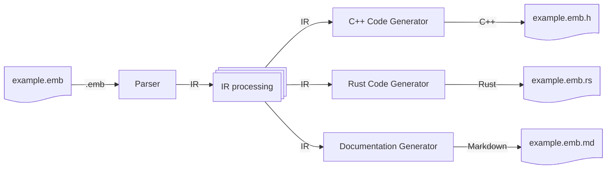

# Design of the Emboss Compiler (`embossc`)

This document describes the internals of the Emboss compiler.  End users do not
need to read this document.


## Overall Design

The Emboss compiler follows a reasonably standard compiler design, where the
input source text is first converted to an *intermediate representation* (IR),
then various operations are performed on the IR, and finally the IR is used to
construct the final output — at the time of writing, C++ source code:


Currently, the Emboss compiler is split into three programs: the *front end*,
which parses the input and does almost all of the IR processing, the *C++
back end*, which does a minimal amount of C++-specific IR processing and
generates the final C++ code, and the `embossc` driver that combines the front
end and back end.  This split makes it straightforward to add new back ends
later:




### IR

Most of the Emboss compiler operates on a data structure known as an *IR*, or
intermediate representation.  The Emboss IR is a tree, with node types defined
in [compiler/util/ir_data.py][ir_data_py].

[ir_data_py]: ../compiler/util/ir_data.py

The first stage of the compiler — the parser — generates an "initial" IR, which
only contains information that is directly available in the source tree.  Even
without any further information, the initial IR can be quite large even for a
very short `.emb` file.  For example, this line:

```emb
  0  [+4]   UInt        file_state
```

turns into this IR (in JSON serialization) immediately after parsing:

```json
{
  "location": {
    "start": {
      "constant": {
        "value": "0",
        "source_location": "22:3-22:4"
      },
      "source_location": "22:3-22:4"
    },
    "size": {
      "constant": {
        "value": "4",
        "source_location": "22:8-22:9"
      },
      "source_location": "22:8-22:9"
    },
    "source_location": "22:3-22:10"
  },
  "type": {
    "atomic_type": {
      "reference": {
        "source_name": [
          {
            "text": "UInt",
            "source_location": "22:13-22:17"
          }
        ],
        "source_location": "22:13-22:17"
      },
      "source_location": "22:13-22:17"
    },
    "source_location": "22:13-22:17"
  },
  "name": {
    "name": {
      "text": "file_state",
      "source_location": "22:25-22:35"
    },
    "source_location": "22:25-22:35"
  },
  "existence_condition": {
    "boolean_constant": {
      "value": true,
      "source_location": "22:3-22:35"
    },
    "source_location": "22:3-22:35"
  },
  "source_location": "22:3-22:35"
}
```

In graphical form (with `source_location` nodes omitted for clarity):


This initial IR then goes through a series of *elaborations*, which annotate
the IR, and *validations*, which check various properties of the IR.  These are implemented as *stages* in the compiler:


In many cases, elaborations and validations are mixed together — for example,
in the symbol resolution stage, names in the IR (`field`) are *elaborated* with
the absolute symbol to which they resolve (`module.Type.field`), and, at the
same time, the symbol resolver *validates* that every name resolves to exactly
one absolute symbol.  At the end of this process, the IR is much larger:


### Front End vs Back End(s)

The Emboss compiler is divided into a front end, which does most of the work,
and back ends, which do language-specific validations and translate the final
IR to the final output format.  Currently, only a C++ back end exists.

The compiler is structured so that the front end and back end can run as
separate programs, and when building with Bazel they do run separately.  For
efficiency, the [`embossc`][embossc_source] driver just imports the front end
and C++ back end directly, so that it can skip the JSON serialization and
deserialization steps.

[embossc_source]: ../embossc

The front end consists of (as of the time of writing) 14 stages:

1.  Tokenization
2.  Parse Tree Generation
3.  Parse Tree → IR
4.  Desugaring + Built-In Field Synthesis
5.  Symbol Resolution Part 1: Head Symbols
6.  Dependency Cycle Checking
7.  Dependency Order Computation
8.  Symbol Resolution Part 2: Field Access
9.  Type Annotation
10. Type Checking
11. Bounds Computation
12. Front End Attribute Normalization + Verification
13. Miscellaneous Constraint Checking
14. Inferred Write Method Generation

Each of these stages will be explained in more detail later in this document.

The C++ back end is much simpler, with only 2 stages:

1. Back-End Attribute Normalization + Verification
2. C++ Header Generation


### IR Traversal

Most stages walk the IR one (or more) times, processing or checking specific
types of nodes.  The Emboss compiler uses a special
[`fast_traverse_ir_top_down()`][traverse_ir] function that takes a *pattern*
and calls a handler on all nodes that match that pattern.
`fast_traverse_ir_top_down()` has been optimized to walk trees efficiently: it
will skip branches if no node in the branch could possibly match the pattern.

[traverse_ir]: ../compiler/util/traverse_ir.py#:~:def%20fast_traverse_ir_top_down

For example, this will call `print()` every `Word` in the IR:

```
fast_traverse_ir_top_down(ir, [ir_data.Word], print)
```

Or you could limit the scope to only `Word` nodes inside of `Import` nodes:

```
fast_traverse_ir_top_down(ir, [ir_data.Import, ir_data.Word], print)
```

`fast_traverse_ir_top_down()` has a lot of options.  For full usage, see
[its documentation in the source code][traverse_ir].


### Error Handling

The general scheme for running stages is:

```
for stage in stages:
    next_ir, errors = stage(prev_ir)
    if errors:
        return None, errors
    prev_ir = next_ir
return prev_ir, None
```

That is: run each stage, and if the stage returns any errors, stop processing
and return the error(s).

Errors are represented by lists of [messages][error_py] (`error`, `warning` or
`note`), where, generally, the first message will be an `error` or `warning`,
and any subsequent messages are `note` messages that provide additional
information.

[error_py]: ../compiler/util/error.py


## Front End

[*`compiler/front_end/...`*](../compiler/front_end/)

The front end is responsible for reading in Emboss definitions and producing a
normalized intermediate representation (IR).  It is divided into several steps:
roughly, parsing, import resolution, symbol resolution, and validation.

The front end is orchestrated by [glue.py][glue_py], which runs each front end
component in the proper order to construct an IR suitable for consumption by the
back end.

[glue_py]: ../front_end/glue.py

The front end driver program is [emboss_front_end.py][emboss_front_end_py],
which just calls `glue.ParseEmbossFile` and prints the results.

[emboss_front_end_py]: ../front_end/emboss_front_end.py


### Tokenization and Parsing

The first part of the front end translates the text of the `.emb` input into an
IR structure.


#### Tokenization

[*`tokenizer.py`*](../compiler/front_end/tokenizer.py)

The very first stage is tokenization, also called lexical analysis or lexing.
Tokenization breaks the input text into *tokens* of one or more characters.
For example, take the string `abc+def`:

```
+---+---+---+---+---+---+---+
| a | b | c | + | d | e | f |
+---+---+---+---+---+---+---+
```

This will be grouped into three tokens, `abc`, `+`, and `def`:

```
+-----------+-----+-----------+
|    abc    |  +  |    def    |
| SnakeWord | "+" | SnakeWord |
+-----------+-----+-----------+
```

In addition, each token is labeled with a category, such as `Documentation`,
`Number`, or `"*"`: by convention, tokens that are always a specific sequence
of characters are given a label that is just the token in double quotes, such
as `"+"` for `+`, `"=="` for `==`, `"if"` for `if`, and so on.

These category labels match names in the grammar in the next step.

There is one extra bit of logic in the Emboss tokenizer, which mimics CPython:
indentation is tracked and translated into special `Indent` and `Dedent`
tokens when it changes.  This fragment:

```emb
struct Foo:
  -- word
```

will be tokenized as:

```
+----------+-----------+-----+------+--------+---------------+--------+
|  struct  |    Foo    |  :  |  \n  |        |    -- word    |        |
| "struct" | SnakeName | ":" | "\n" | Indent | Documentation | Dedent |
+----------+-----------+-----+------+--------+---------------+--------+
```


#### Parse Tree Generation

[*`lr1.py`*](../compiler/front_end/lr1.py)

The list of tokens is then passed to a parser, which produces a parse tree.
The point of this stage is to take the list of tokens, and apply a tree
structure on top of it.  Starting with the tokens from the previous example:


the parser infers the parse tree:


Parsing is a large subject with many good tutorials and references available,
so only the `embossc` specifics are covered here.

The Emboss compiler uses a [shift-reduce (also known as "LR(1)")
parser][shift_reduce], using a [custom engine][lr1_py] that has some features
that are not available in most other shift-reduce engines — and also some
limitations.

[shift_reduce]: https://en.wikipedia.org/wiki/Shift-reduce_parser
[lr1_py]: ../compiler/front_end/lr1.py

The biggest limitation is that the table generator only implements the
[canonical LR(1)][canonical_lr1] table generation algorithm, which means that
there is no "side channel" way of specifying precedence or otherwise resolving
conflicts — shift/reduce and reduce/reduce conflicts must be resolved by
removing them from the grammar.  (However, Emboss's grammar uses
partially-ordered precedence, which — as far as the author is aware — is not
supported by any off-the-shelf precedence system.)

[canonical_lr1]: https://doi.org/10.1016/S0019-9958(65)90426-2

The biggest unusual feature is the incorporation of a [*Merr*][merr]-like
system for error messages.

[merr]: https://doi.org/10.1145/937563.937566

The output from this stage is a *parse tree*, not an IR.


#### Parse Tree → IR

[*`module_ir.py`*](../compiler/front_end/module_ir.py)

Finally, the parse tree is transformed into an IR.  This is mostly a
straightforward translation, but there are a few places where the parse tree is
noticeably different from the IR.  For example, in the parse tree, lists are
explicit *cons* lists, like:


while in the IR these lists are flattened:


One bit of pure syntax sugar that is handled at this stage is chained
comparisons: `a == b == c` will be translated to the IR equivalent of `a == b
&& b == c`.


### IR Processing

#### Desugaring + Built-In Field Synthesis

[*`synthetics.py`*](../compiler/front_end/synthetics.py)

The first stage that operates on the IR adds built-in fields like
`$size_in_bytes` and rewrites some constructs to a more regular form.
Specifically, anonymous `bits` will be rewritten into non-anonymous `bits`, and
`$next` will be replaced with the offset + size of the previous field.
Starting with this:

```emb
struct Foo:
    0 [+4]  bits:
        0  [+1]  Flag  low
        31 [+1]  Flag  high
    if low:
        $next [+4]  UInt  field
```

`synthetics.py` will rewrite the IR into (the equivalent of):

```emb
struct Foo:
    bits EmbossReservedAnonymous0:
        [text_output: "Skip"]
        0  [+1]  Flag  low
        31 [+1]  Flag  high
    let $size_in_bytes = $max(0, true ? 0+4 : 0, low ? (0+4)+4 : 0)
    let $max_size_in_bytes = $upper_bound($size_in_bytes)
    let $min_size_in_bytes = $lower_bound($size_in_bytes)
    0 [+4]  EmbossReservedAnonymous0  emboss_reserved_anonymous_1
    if low:
        0+4 [+4]  UInt  field
    let low = emboss_reserved_anonymous_1.low
    let high = emboss_reserved_anonymous_1.high
```

One important detail is that the newly-created nodes are marked as *synthetic*.
This makes a difference for error handling: because of the way that some of the
synthetic nodes are constructed from copied pieces of existing IR, errors can
sometimes be detected in synthetic nodes before they are detected in the
original source nodes they were copied from.  These errors tend to be very
confusing to end users, since they reference parts of the IR that were not
entered by an end user.  For example, the incorrect:

```emb
struct Foo:
    false [+4]  UInt  field
```

will have a synthesized `$size_in_bytes` field:

```emb
struct Foo:
    let $size_in_bytes = $max(0, true ? false+4 : 0)
    false [+4]  UInt  field
```

The erroneous expression `false+4` will be detected before the top-level type
error of using `false` as the field offset, with a message like:

```
example.emb:2:5: error: Left argument of operator '+' must be an integer.
    false [+4]  UInt  field
    ^^^^^
```

To avoid confusing end users, any error with a synthetic location will be
*deferred*, and only shown to an end user if no non-synthetic errors are
encountered during IR processing.  In this case, the correct error message will
be found and displayed to the end user:

```
example.emb:2:5: error: Start of field must be an integer.
    false [+4]  UInt  field
    ^^^^^
```


#### Symbol Resolution Part 1: Head Symbols

[*`symbol_resolver.py`*](../compiler/front_end/symbol_resolver.py)

After desugaring, the first part of symbol resolution occurs: resolving *head*
symbols.  Head symbols are any symbols that do not follow a `.`: for example,
`head` or `Head` in `head`, `Head.field` and `head.Type.field`.  Resolution of
symbols after `.` happens in a later stage, after some other checking.

Head symbol resolution follows lexical scoping rules: a symbol may refer to
entities in a set of *scopes* determined by their position in the source text.

Head symbol resolution is straightforward: while walking down the IR tree,
build up a list of available scopes.  When a symbol is encountered, check to
see if that symbol is *defined* in any of the available scopes.  If it is
defined in *exactly one* available scope, bind the symbol to that definition.
If it is not defined, raise an error.  Emboss takes the unusual step of *also*
raising an error if the symbol is defined in two or more scopes: in most
computer languages, there is some scope precedence, and the highest-precedence
definition is used.  However, this can lead to surprising, and in some cases
*silently incorrect* results when the desired definition is *shadowed* by an
unknown-to-the-user higher-precedence definition, so Emboss raises an error and
requires the user to explicitly pick the correct definition.


#### Dependency Cycle Checking

[*`dependency_checker.py`*](../compiler/front_end/dependency_checker.py)

Once head symbols have been resolved, there is enough information in the IR to
check for cycles in the dependency graph: cases where `object_1` depends on
`object_2` and `object_2` also depends on `object_1`, sometimes through a chain
of multiple dependencies.

The Emboss compiler accomplishes this by first building up the complete
dependency graph of the IR, and then running a graph partitioning algorithm
([Tarjan's algorithm][tarjan], in this case) on the dependency graph to find
all strongly-connected components.  If there are any partitions with more than
one node, or any nodes with a self edge, then there is a dependency cycle.

[tarjan]: https://en.wikipedia.org/wiki/Tarjan%27s_strongly_connected_components_algorithm


#### Dependency Order Computation

[*`dependency_checker.py`*](../compiler/front_end/dependency_checker.py)

Every structure in the IR is also annotated with a 'dependency ordering': an
ordering of its fields such that any field *A* that depends on another field
*B* is later in the ordering than *B*.

This ordering is not used until the back end (where it is used to order fields
for text output), but it is convenient to build it here, where the dependency
graph has already been built.


#### Symbol Resolution Part 2: Field Access

[*`symbol_resolver.py`*](../compiler/front_end/symbol_resolver.py)

Next, "tail" symbols are resolved: any symbol immediately after `.`.  These are
resolved after checking for dependency cycles because the resolution algorithm
can become stuck in infinite recursion if there is a dependency cycle.


#### Type Annotation

[*`type_check.py`*](../compiler/front_end/type_check.py)

With symbols resolved, it is possible to annotate expression types.  The Emboss
compiler annotates *every* expression and subexpression with a type: at this
stage, those types are coarse: integer, enum, boolean, string, "opaque", etc.

This stage also checks expressions for *internal* type consistency.  For
example, it will find the error in:

```emb
struct Foo:
    let a = 10 + true
```

but not in:

```emb
struct Foo:
    true [+4]  UInt  a
```


#### Type Checking

[*`type_check.py`*](../compiler/front_end/type_check.py)

After annotating all types, the compiler checks that expressions have the
correct top-level types: that is, that their types are correct for their
positions within the IR.  This is the stage that detects the use of a boolean
as a field offset from the previous example:

```emb
struct Foo:
    true [+4]  UInt  a
```


#### Bounds Computation

[*`expression_bounds.py`*](../compiler/front_end/expression_bounds.py)

With coarse type checking done, the expression types can be *refined* into
narrower types: for example, instead of just "integer," "integer between 0 and
65535, inclusive."

Fully understanding this stage involves (just a tiny bit!) of Type Theory:
mainly, that a "type" in the computer science sense is just a *set* (in the
mathematical sense) of all the values that a variable of that type could
possibly hold.  This sort of "type" is conflated with physical layout in most
industrial computing languages (including Emboss), but is conceptually
separate.

The boolean type is the set $\left\\{ \scriptstyle{FALSE}, \scriptstyle{TRUE}
\right\\}$, so its only refinements (nonempty subsets) are $\left\\{
\scriptstyle{FALSE} \right\\}$ and $\left\\{ \scriptstyle{TRUE} \right\\}$.
This stage will try to make those refinements, where possible.

The base integer type in the Emboss expression language is the set of all
integers, normally written as $\mathbb{Z}$.  It is obviously impossible for any
real-world computer to have a variable of type $\mathbb{Z}$ — there is no
computer with infinite memory — so this type needs to be refined.

In Emboss, currently, integer types are refined into the form $\left\\{ x | x
\in \mathbb{Z} \wedge a \le x \le b \wedge x \equiv n \pmod m \right\\}$: that
is, $x$ is an integer ($x \in \mathbb{Z}$), $x$ is at least $a$ and at most $b$
($a \le x \le b$), and $x$ % $m$ == $n$ ($x \equiv n \pmod m$).  The values $a$
and $b$ are lower and upper bounds, respectively, while $m$ and $n$ are used
for alignment tracking — $m$ tracks the "level" of alignment, and $n$ tracks
the "offset" within the alignment.

This integer type refinement starts with known types.  A value read from an
`Int` or `UInt` field will have known bounds (based on the bit width of the
field), $m = 1$ and $n = 0$.  Constants simply have $a = b = n =
\scriptstyle{VALUE}$ and $m = \infinity$.

From this basis, the refinements for any operations can be determined.  For
example, for `x + y`, the resulting lower and upper bounds $a = a\sub{x} +
a\sub{y}$ and $b = b\sub{x} + b\sub{y}$.  The resulting alignment is a little
more complex, involving the greatest common divisor function.

The Emboss functions `$lower_bound(x)` and `$upper_bound(x)` are a little
strange: their result is a constant that is the lower or upper bound
(respectively) of their argument!  That is, they extract a value from the type
system and return it as an expression.  There aren't a lot of human-authored
uses of these functions, but they are used in the (synthetic) definitions of
fields like `$min_size_in_bytes` and `$max_size_in_bits`.

The refinements that Emboss finds are not always perfectly optimal, for various
reasons: for example, even if `x < 0`, `x * x` cannot be negative, but Emboss
does not try to detect any *cross-argument constraints*, so it will not figure
this out.

It might be tempting to add better refinement to Emboss, but there are
downsides.  First, new refinements take up compiler time, which can contribute
to slow builds.  Many possible refinements would only be found on a tiny
fraction of all expressions, so it is not worth the compiler time to search for
them.

Second, and probably more importantly, any new refinements become part of the
Emboss contract with end users, forever: `$upper_bound()` must never return a
larger value than it did in previous versions, and `$lower_bound()` must never
return a smaller value.  This has direct implications for maintainence of the
current Emboss compiler, but it also makes it even harder for any third-party
compiler to fully implement Emboss — which, in turn, means that Emboss is even
more likely to be a single-vendor language, like Python or Ruby, instead of a
multi-vendor language like C++ or JavaScript.


#### Front End Attribute Normalization + Verification

[*`attribute_checker.py`*](../compiler/front_end/attribute_checker.py`)

This stage checks the attributes (annotations like `[byte_order:
"LittleEndian"]`) that are used by the Emboss front end, and adds missing
attributes where needed.

Attributes were originally intended to be a way to add functionality without
having to add new syntax, so their semantics are not conceptually cohesive.
Nonetheless, they are all handled together in the same stage.

This stage checks that all attributes have the correct argument type (no
`[byte_order: 10]`) and that their values are valid (no `[byte_order:
"scrambled"]`).  `$default`'ed attributes have their values copied into every
place in the IR where they make sense and were not overridden (so `[$default
byte_order: "BigEndian"]` will cause `[byte_order: "BigEndian"]` to be attached
to most fields that do not already have a `[byte_order]` attribute).


#### Miscellaneous Constraint Checking

[*`constraints.py`*](../compiler/front_end/constraints.py)

Even more conceptually incoherent than the previous stage, constraint checking
verifies that certain things are true about the IR:

*   Fields in `bits` have types that are allowed in `bits`.
*   Arrays have constant sizes for all dimensions other than the last one,
    which may be empty.
*   Arrays in `struct` are arrays of types that are a whole number of bytes
    long (no `UInt:4[]`).
*   In `T[]`, `T` has a constant size.
*   That fields with `external` types like `Int`, `Flag`, etc. meet the
    requirements for those types, in terms of size.
*   That enum, field, and type names are not reserved words in any existing
    mainstream programming language as of 2014, even if they are not Emboss
    keywords.  For example, no field may be named `class`, even though Emboss
    does not care.
*   That constant references (references of the form `Type.field`) are actually
    constant.
*   That all enum values can be represented as 64-bit unsigned or signed
    2's-complement integers (or narrower, if the `enum` has an explicit,
    narrower width).
*   That all expression values *that might be computed at runtime* fit within
    64-bit unsigned or signed 2's-complement integers.

The common theme of these is that they are not used anywhere in the front end,
but they simplify the back end by reducing the cases that have to be handled.

Most of these constraints could be lifted at some point.


#### Inferred Write Method Generation

[*`write_inference.py`*](../compiler/front_end/write_inference.py)

This stage — the last before the IR goes to the band end — figures out how to
write through virtual fields.  There are three possibilities:

If the virtual field is a direct alias (`let field = some_other_field`), then
writing through `field` is exactly the same as writing through
`some_other_field`.  In fact, it is *so* exactly the same that the C++ back end
handles this by making the `field()` method call just return the view of
`some_other_field()` directly.  This works even if `some_other_field` is
actually a nested field, like `some.other.field`.

This method is most important for anonymous `bits`: it is important to be able
to write through the aliases because the original field is not accessible to
end users.

If the virtual field is a series of additions and subtractions on exactly one
other field, like `let f_plus_10 = f + 10`, then a special "write" expression
will be generated that inverts the calculation: in this case, `f_plus_10 - 10`.
It was the intention of the Emboss authors to expand this inference over time,
but (currently) addition and subtraction are the only fully-invertible
operations in the Emboss expression language.

Lastly, if neither of the other options apply, the field is read-only.

It was also the intention to open this feature up to users by allowing "write
method" attributes to be attached to virtual fields, like:

```emb
# An example from an actual device, where `x` is a frequency expressed in
# either Hz or MHz.
let f = x < 1000 ? x * 1000000 : x
    [write_field: x]
    [write_expression: value]
```


### C++ Back End

[*`compiler/back_end/cpp`*](../compiler/back_end/cpp)

The C++ back end transforms the fully elaborated IR into a header file.


#### C++ Back-End Attribute Verification

[*`attributes.py`*](../compiler/back_end/cpp/attributes.py)

[*`header_generator.py`*](../compiler/back_end/cpp/header_generator.py)

The first stage of the C++ back end is a short one: it verifies that the
`[(cpp) namespace]` attribute, if present, is a valid C++ namespace.


#### C++ Header Generation

[*`header_generator.py`*](../compiler/back_end/cpp/header_generator.py)

The very last stage walks the IR and produces the text of a C++ `.h` file.

Unlike most stages, C++ header generation does *not* use
`fast_traverse_ir_top_down()`: the code to walk the tree is manual, generally
assembling fragments of C++ code from the bottom up.

This stage has the most code of any single stage of the Emboss compiler, so it
can be difficult to follow.  (It is also some of the oldest code in the
compiler, which does not help.)
