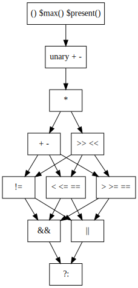

# Design Sketch: Left and Right Bit Shift Operators

## Overview

This is a proposal to add left and right shift to the Emboss expression
language.

Bit shifts are common in embedded systems work.  Sometimes, the lack of bit
shifts in Emboss can be worked around, such as:

```
bits Control:
  0 [+8] UInt control_byte
  0 [+4] UInt frame_type_1
  4 [+1] UInt p_f
  5 [+3] UInt frame_type_2

  # frame_type_1 | (frame_type_2 << 5)
  let frame_type = frame_type_1 + frame_type_2 * 32
```

However, this is awkward, and only works for left shift by a constant value.

It would also be useful to add bitwise and, or, xor, and not operators, but
those are not in scope for this proposal.


## Syntax

### Symbol

The symbols `<<` and `>>` are used for bit shift operators in many common
programming languages.  For `>>`, the choice of whether to sign-extend or
zero-extend ("arithmetic" or "unsigned") usually depends on the type of the
left operand.  Java, C#, and JavaScript have an additional "unsigned right
shift" operator `>>>`, which I believe is due to the (historical) lack of an
unsigned integer type in those languages.

Other than `<<` and `>>`, other languages use functions with language-specific
names.

| Language   | Left Shift        | Right Shift (RS)                       |
| ---------- | ----------------- | -------------------------------------- |
| ASM (x86)  | `SAL`/`SHL`       | `SAR` (arithmetic), `SHR` (unsigned)   |
| ASM (ARM)  | `LSLV`            | `ASRV` (arithmetic), `LSRV` (unsigned) |
| C          | `<<`              | `>>`                                   |
| C++        | `<<`              | `>>`                                   |
| C#         | `<<`              | `>>` (arithmetic), `>>>` (unsigned)    |
| Go         | `<<`              | `>>`                                   |
| Fortran    | `SHIFTL()`        | `SHIFTA()` (arithmetic), `SHIFTR()` (unsigned) |
| Haskell    | `shift`, `shiftL` | `shift` by negative, `shiftR`          |
| Java       | `<<`              | `>>` (arithmetic), `>>>` (unsigned)    |
| JavaScript | `<<`              | `>>` (arithmetic), `>>>` (unsigned)    |
| Lua        | `<<`              | `>>` (unsigned)                        |
| MatLab     | `bitshift(A, k)`  | `bitshift(A, -k)`                      |
| OCaml      | `shift_left`      | `shift_right`                          |
| Perl       | `<<`              | `>>`                                   |
| PHP        | `<<`              | `>>` (arithmetic)                      |
| Python     | `<<`              | `>>`                                   |
| Rust       | `<<`              | `>>`                                   |
| SQL        | Nonstandard       | Nonstandard                            | 


#### Proposal

Emboss should use `<<` and `>>` operators for left and right shift.  For now,
`>>` should always be arithmetic right shift: since integers in the Emboss
expression language are notionally infinite-precision, there is not a 'natural'
number of bits at which to cut off negative numbers.

Once/if bitwise operators are implemented, unsigned right shift can be handled
by forcing the left operand into an unsigned representation using `&`.


### Precedence

The precedence of `>>` and `<<` is consistent across many languages, sitting
between additive operators (binary `+` and `-`) and comparison operators (`<`,
`>`, and so on).

There is inconsistency in the precedence of `&`, `^`, and `|`, with many
languages taking C's choice (binary bitwise operators bind less tightly than
comparisons) and a notable minority fixing C's mistake (by putting bitwise
operators between shifts and comparisons).


#### C, C++, Perl, JavaScript, Java, & C#

1. `+` `-`
2. `<<` `>>` `>>>`
3. `<` `<=` `>` `>=`
4. `==` `!=
5. `&`
6. `^`
7. `|`


#### Rust, Python, & Lua

1. `+` `-`
2. `<<` `>>
3. `&`
4. `^`/`~`
5. `|`
6. `==` `!=`/`~=` `<` `>` `<=` `>=`


#### Go

1. `*` `/` `%` `<<` `>>` `&` `&^`
2. `+` `-` `|` `^`
3. `==` `!=` `<` `<=` `>` `>=`
4. `&&`
5. `||`


#### Straw Poll

An informal poll of other developers found that some developers have a mental
model roughly equivalent to:

1. `+` `-` `<<` `>>`
2. `<` `<=` `>` `>=`

In particular, the expression `5 + 11 >> 1 + 1` was thought to evaluate to 11
by some, and 4 (as in all common programming languages other than Go) by
others.


#### Proposal

Emboss's operator precedence is not a strict ordering: certain operators (such
as `&&` and `||`) are neither higher, lower, or equal in precedence to each
other, and as such cannot be mixed without parentheses.

Given the developer confusion around `>>` vs `+`, Emboss's precedence should be
(changes in **bold**):

1.  `()` `$max()` `$present()` `$upper_bound()` `$lower_bound()`
2.  unary `+` and `-` (cannot be combined without parentheses)
3.  `*`
4.  {`+` `-`} **/ {`<<` `>>`} (`+` and `-` cannot be combined with `>>` or `<<`
    without parentheses)**
5.  {`!=`} / {`<` `<=` `==`} / {`>` `>=` `==`} (comparisons in the same
    direction can be *chained*; comparisons in opposite directions cannot be
    combined without parentheses)
6.  {`&&`} / {`||`} (`&&` and `||` cannot be combined without parentheses)
7.  `?:`

In diagram form:




## Semantics

### Shifts by 0, Negative, or Large Values

It appears that all (common?) languages properly handle shifts by 0, treating
them as a no-op.

Shifts by values equal to or larger than the width of the left operand (e.g.,
64 bits on a 64 bit system) are split between treating them as an error, shift
by the low-order bits of the right operand (e.g., mask to low 6 bits for 64-bit
operands), or return 0 or -1.  Common hardware appears to mask to the low bits.

Shifts by negative values are similarly split between treating them as an
error, shift by the low-order bits of the right operand (so a shift by -1 is
equivalent to a shift by 63), or shift in the opposite direction.

One particularly notable issue is that C++ (until C++20) and C both treat left
shift as undefined when the left operand is negative.  This is contrary to
every other language checked, including x86 and ARM assembly (both 32- and
64-bit).

In the table below, "UB" indicates undefined behavior (e.g., a program that
performs that operation is not valid), and "IDB" indicates
implementation-defined behavior (a program that performs the operation is
valid, but the result varies depending on the implementation).

| Language   | `x>>0` | `x<<0` | `-2<<x` | `x<<64`  | `x>>64`  | `x>>-1`   |
| ---------- | ------ | ------ | ------- | -------- | -------- | --------- |
| ASM (x86)  | `x`    | `x`    | `-2<<x` | `x<<0`   | `x>>0`   | `x>>63`   |
| ASM (ARM)  | `x`    | `x`    | `-2<<x` | `x<<0`   | `x>>0`   | `x>>63`   |
| C++11      | `x`    | `x`    | UB      | UB       | UB       | UB        |
| C++20      | `x`    | `x`    | `-2<<x` | UB       | UB       | UB        |
| C          | `x`    | `x`    | UB      | UB       | UB       | UB        |
| C#         | `x`    | `x`    | `-2<<x` | `x<<0`   | `x>>0`   | `x>>63`   |
| Go         | `x`    | `x`    | `-2<<x` | `0`      | `0`      | ?         |
| Fortran    | `x`    | `x`    | `-2<<x` | UB       | UB       | UB        |
| Haskell    | `x`    | `x`    | `-2<<x` | `0`      | `0`      | Panic     |
| Java       | `x`    | `x`    | `-2<<x` | `x<<0`   | `x>>0`   | `x>>63`   |
| JavaScript | `x`    | `x`    | `-2<<x` | `x<<0`   | `x>>0`   | `x>>63`   |
| Lua        | `x`    | `x`    | `-2<<x` | `0`      | `0`      | `x<<1`    |
| OCaml      | `x`    | `x`    | `-2<<x` | IDB      | IDB      | IDB       |
| Perl       | `x`    | `x`    | `-2<<x` | Varies   | `x>>64`  | `x<<1`    |
| PHP        | `x`    | `x`    | `-2<<x` | `0`      | `0`      | Exception |
| Python     | `x`    | `x`    | `-2<<x` | `x>>64`  | `x>>64`  | Exception |
| Rust       | `x`    | `x`    | `-2<<x` | UB       | UB       | Overflow  |


#### Proposal

Emboss can use its bounds system to ensure that no shifts by too-large or
negative amounts can happen at runtime.  This ensures that no surprising or
undefined behavior can occur in generated code.

This may prove to be overly restrictive, but it can be loosened in the future,
if necessary.


### Expression Bounds and Modular Value Calculations

#### Left Shift

For a shift `x << y`, there are several cases to consider:

1.  `x` and `y` are both constants: in this case, the result is also a
    (pre-computed) constant.
2.  Only `y` is a constant: when `y` is a constant, `x << y` is equivalent to
    `x` × 2<sup>y</sup>.  The minimum value, maximum value, modulus, and
    modular value of the result are all equal to 2<sup>y</sup> multiplied by
    the respective bound on `x`.
3.  Otherwise:
    *   `minimum_value` is either `minimum value of x << maximum value of y` or
        `minimum value of x << minimum value of y`, depending on signs
    *   `maximum_value` is either `maximum value of x << minimum value of y` or
        `maximum value of x << maximum value of y`, depending on signs
    *   `modular_value` is 0
    *   `modulus` is:
        *   `infinity` if the `modulus` of `x` is `infinity` and the
            `modular_value` of `x` is 0
        *   2<sup>minimum value of `y`</sup> × (largest power-of-2 factor of
            the `modular_value` of `x`) if the `modulus` of `x` is
            `infinity`
        *   2<sup>minimum value of `y`</sup> × (largest power-of-2 factor of
            the modulus of `x`) if the `modular_value` of `x` is 0
        *   2<sup>minimum value of `y`</sup> × min(largest power-of-2 factor
            of the `modular_value` of `x`, largest power-of-2 factor of the
            `modulus` of `x`) if the `modular_value` of `x` is not 0

These rules have been prototyped and tested against all valid bounds and
inhabiting values of those bounds with bound values from -32 through +32,
inclusive.


#### Right Shift

For a shift `x >> y`, there are several cases to consider:

1.  `x` and `y` are both constants: in this case, the result is also a
    (pre-computed) constant.
2.  `y` is a constant and the `modulus` and `modular_value` of `x` are both
    evenly divisible by 2<sup>y</sup>: in this case, the bounds of the result
    are equal to the corresponding bounds on `x` divided by 2<sup>y</sup>.
    Note that this is a special case of computing the bounds for
    [division](./division_and_modulus.md#division).
3.  Otherwise:
    *   `minimum_value` is either `minimum value of x >> maximum value of y` or
        `minimum value of x >> minimum value of y`, depending on signs
    *   `maximum_value` is either `maximum value of x >> minimum value of y` or
        `maximum value of x >> maximum value of y`, depending on signs
    *   `modular_value` is 0
    *   `modulus` is 1

These rules have been prototyped and tested against all valid bounds and
inhabiting values of those bounds with bound values from -32 through +32,
inclusive.

There are definitely tighter bounds that can be inferred in some cases (e.g., a
shift of a constant `x` by a `y` that can only take 2 values will have a result
that can only take 2 values, but will not, in general, have an inferred bound
that only covers those two values), but these rules seem to cover most cases
without being particularly computationally expensive.


## Implementation Notes

### Parser

The parser can be modified by putting in parallel rules for `shift-`
nonterminals wherever a rule references any `additive-` nonterminal.  This will
automatically create a set of rules that put the `<<` and `>>` operators into a
new precedence that is at the same level as, but cannot be mixed with, the
additive operators.


### Runtime

The C++ implementation of the left shift operator should avoid undefined
behavior by using `static_cast<std::make_unsigned<T>::type>()` on its operands
before shifting, and then convert back to `T` for the result.  Note that the
conversion back to `T` cannot (always) be done with a simple cast until C++17.
There is some code in `IntView` that properly implements the conversion for ISO
C++11, which should be factored out so that it can be shared.
