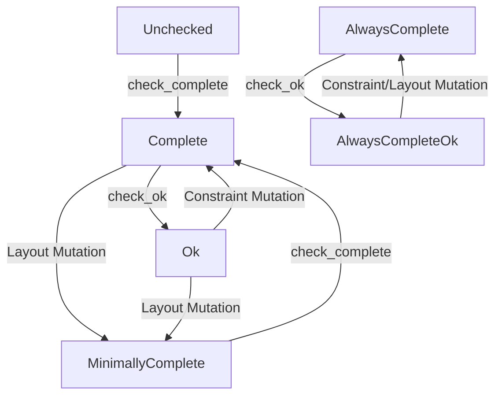

# Rust Code Generation Backend for Emboss

## Motivation

Emboss currently supports generating C++ code for parsing and validating binary data structures. As Rust becomes more widely used for systems programming and protocol implementations, there is a growing need for native Rust support in Emboss.

This document proposes a design for an Emboss Rust backend. The goal is to generate Rust code that provides the same safety, zero-copy, and efficiency guarantees as the C++ backend, while integrating naturally with Rust's type system and safety features.

## Requirements

A Rust backend for Emboss should satisfy the following requirements:

1.  **Zero-copy**: Accessing fields should not require copying data into intermediate structures.
2.  **Safety**: The generated API must be memory-safe. Any use of `unsafe` must be internal to the runtime, minimized, and thoroughly verified.
3.  **Idiomatic Rust**: The API should feel natural to Rust developers, utilizing features like `Result`, `Option`, and traits.
4.  **`no_std` and `no_alloc` Support**: The core parsing functionality and generated code must advance embedded systems use cases by supporting `#![no_std]` and requiring no heap memory allocation. Auxiliary features (like text serialization) may optionally require `std`.

## Proposed Design

### Views and Storage

Similar to the C++ backend, the core concept of the Rust backend is a "view" over backing storage. A view does not own the data; it references a backing storage. The main view type representing a generated structure is referred to as the **base view**.

#### Storage Genericity
The generated views are generic over the storage type `S: Storage`. While `&[u8]` is the default slice-backed storage implementation, any custom storage backend (e.g. ring buffers, page-aligned buffers, or scatter-gather lists) that implements the `Storage` trait is fully supported.

#### Copy/Clone Semantics
A view inherits the `Copy` and `Clone` capabilities of its underlying storage type:
*   A view using a shared slice, `BasicType<&'a [u8]>`, naturally implements `Copy` and `Clone`.
*   A writer view using a mutable slice, `BasicType<&'a mut [u8]>`, does **not** implement `Copy` or `Clone` and is move-only, satisfying Rust's exclusive access rules.

#### Aliasing
All access and borrow safety is managed transparently via standard Rust borrows and lifetimes. Multiple read-only views can borrow the same buffer concurrently, while writer views require exclusive access, enforced at compile time by Rust's borrow checker. No custom unsafe compiler trickery is introduced.

#### Passing Nested Views (View Detachment)
Helper functions that process sub-structures should be generic over the storage to accept nested views:
```rust
fn process_payload<S: Storage>(payload: Payload<S>) { ... }
```
If a storage type supports sub-slicing (producing a slice of the parent's storage), a sub-view can be "detached" from its nested wrapper (`NestedStorage<Outer>`) to yield a flat view backed directly by the parent's slice type (e.g., yielding `Payload<&[u8]>` from a `Parent<&[u8]>`). The Emboss runtime remains agnostic to how the storage slice is implemented.

Consider the simple `BasicType` definition:

```emboss
[$default byte_order: "BigEndian"]

struct BasicType:
  0 [+2]  UInt  a
  2 [+2]  UInt  b
```

A reader view can be constructed and accessed as follows:

```rust
// Example usage of a generated view
let buf = [0x01, 0x0A, 0x02, 0x0B];
let view = BasicType::new(&buf);
assert_eq!(view.a().try_read(), Ok(0x010A));
```


### Escape Hatches

When developers need to drop out of the native Emboss typed API and interact with underlying data:
1. **Accessing Storage:** The underlying storage can be borrowed via `.storage()` on any view, or taken by value via `.into_storage()`.
2. **Reading/Writing Beyond Boundaries:** If you need to read bytes outside the bounds of the current logical view, you can extract the storage using the methods above and perform slice operations manually. This prevents out-of-bounds access natively through the view interfaces while supporting flexible manual manipulation.
3. **Reattaching Views:** Because the `Storage` trait is implemented for native slice types like `&[u8]`, developers can manually slice a buffer and construct a new, independent view over that specific slice whenever needed.

### Accessor API

In the initial implementation, the API prioritizes simplicity and safety. Fields cannot be accessed directly without runtime bounds checks. 

Read and write accessors perform dynamic bounds checking on the fly and return `Result` types. A view constructed over mutable storage (`MutStorage` such as `&mut [u8]`) naturally supports modification without requiring specialized writer types.

For example, using the `BasicType` defined above:

```rust
let mut buf = [0u8; 4];
let mut view = BasicType::new(&mut buf);

view.a().try_write(0x070A)?;
view.b().try_write(0x080B)?;

let val = view.a().try_read()?;
```

### Versioning and Support

* Initial implementation will land clearly marked `experimental`, and should not be relied upon to not change yet. During that period we will target the 2024 edition, though we don't intend to rely on features that would preclude earlier edition support.
* Once we stabilize the implementation, we'll declare it as such and remove the experimental marker.
* We will make a decision on support timelines at that time, but suggest a 3 year window, essentially the current edition and previous edition (which are on 3 year tracks), as the Rust ecosystem and tooling tends to support the latest versions quickly and provide tools for easy upgrading.
* That said, that support window is subject to change pending additional discussion and final decision is out of scope of this proposal.
* During the experimental period, intentional breaking changes should be communicated to the emboss mailing list.

### Naming Conventions

Emboss's enforced naming conventions align with Rust conventions:
*   `CamelCase` for struct/enum types maps to Rust `CamelCase` structs/enums.
*   `snake_case` for fields maps to Rust `snake_case` methods.
*   `SHOUTY_CASE` for enum values and constants maps to Rust `SHOUTY_CASE` constants.
*   **Rust Keywords**: If an Emboss field or type name collides with a Rust keyword (e.g., `type`, `match`), the generator will escape it using Rust's raw identifier syntax (e.g., `r#type`).

#### Trait Disambiguation
Emboss structures can have fields with arbitrary names. To avoid naming conflicts between generated field accessors and built-in helper methods (like `size_in_bytes` or `storage`), helper methods are defined on traits (e.g., `emboss_runtime::StructView`).

Disambiguation is achieved by calling the trait method directly:
```rust
// Accessing a field named `size_in_bytes`
let field_val = view.size_in_bytes().try_read();

// Accessing the helper method to get the view size
let view_size = StructView::size_in_bytes(&view);
```

### Generator Implementation Strategy
The Rust backend generator will be implemented in Python, integrated directly into the existing Emboss compiler toolchain.
*   It will reuse the existing Python-based frontend utilities, including the DDL parser, AST representation, and semantic analyzer.
*   It will also reuse the existing backend framework utilities. Only the C++ generator code and templates will be replaced with Rust counterparts.
*   Implementing an alternative backend compiler framework is out of scope.

## Alternatives Considered

### 1. Serialization / Deserialization (Copying)

One alternative is to parse the bytes into a standard Rust `struct` on read, and serialize it back to bytes on write.

*   **Pros**: Simple to implement, idiomatic Rust.
*   **Cons**: Introduces copy overhead (violates Requirement 1). Parsing the entire structure is inefficient if only a single field is needed. Cannot easily handle invalid or partially-written data.

### 2. Direct Layout Mapping (e.g., Zerocopy)

Another alternative is to use safe casting to map a Rust `struct` directly onto a byte slice.

*   **Pros**: Zero-copy, high performance.
*   **Cons**: Cannot handle complex Emboss features such as:
    *   Conditional/optional fields.
    *   Dynamically sized fields.
    *   Bitfields and non-power-of-two integers (e.g., 24-bit integers).
    *   Fields with alignment constraints that do not match the CPU.


## Future Work: Advanced Typestates

To avoid runtime overhead while ensuring safety, we propose using a typestate pattern to track the validation and completeness status of a view at compile time.

A view or writer can be in one of several states:
*   `UncheckedState`: The initial state (mapping directly to the default fallible approach described above). Fields cannot be accessed directly without runtime bounds checks. Read/write accessors in this state perform dynamic bounds checking on the fly.
*   `MinimallyCompleteState`: The buffer is known to be at least large enough for the minimum size of the structure.
*   `CompleteState`: The buffer is large enough for the current dynamic layout of the structure. Always-present fields can be read/written without runtime bounds checks.
*   `AlwaysCompleteState`: The buffer is large enough for the maximum possible size of the structure.
*   `OkState`: The structure is both `CompleteState` and logically valid (all `requires` constraints are satisfied).
*   `AlwaysCompleteOkState`: The structure is both `AlwaysCompleteState` and logically valid.

> [!NOTE]
> **Dynamic Sub-structures**: A dynamically sized sub-structure cannot inherently inherit the exact completeness typestate from its parent. If a parent is `AlwaysCompleteState`, but it contains a conditionally sized sub-view, the accessed sub-view must have its typestate dynamically downgraded (e.g., down to `MinimallyCompleteState`) upon access, requiring a runtime completeness check on the sub-view's own presence fields to ascend back to `CompleteState`.

State transitions occur when validation functions are called or when fields are mutated (since writing to a field might change the layout or invalidate constraints).

### The Consuming Writer Pattern

Because mutating a layout-affecting field invalidates the bounds of subsequent fields, typestate writers must consume themselves on mutation and return a newly-typed writer representing the transitioned state. 

To use infallible writes, a view is explicitly transitioned into a consuming writer:

```rust
let mut buf = [0u8; 4];
let view = BasicType::new(&mut buf)
    .check_complete()?       // Validates bounds, transitions to CompleteState
    .into_writer()           // Transitions into a typestate-tracked writer
    .a().write(0x070A)?      // Consumes and returns the transitioned writer
    .b().write(0x080B)?
    .into_view();            // Recovers the base view
```


#### State Transition Matrix
The following table defines the target state for a write operation based on the starting state and the field category:

| Initial State | Field Category | Resulting State | Signature Style |
| :--- | :--- | :--- | :--- |
| **`AlwaysCompleteState`** | Any Field | `AlwaysCompleteState` | Consuming |
| **`CompleteState`** | Layout-Neutral | `CompleteState` | Consuming |
| **`CompleteState`** | Layout-Affecting | `MinimallyCompleteState` | Consuming |
| **`AlwaysCompleteOkState`** | Layout-Neutral & Constraint-Neutral | `AlwaysCompleteOkState` | Consuming |
| **`AlwaysCompleteOkState`** | Layout-Affecting / Constraint-Affecting | `AlwaysCompleteState` | Consuming |
| **`OkState`** | Layout-Neutral & Constraint-Neutral | `OkState` | Consuming |
| **`OkState`** | Constraint-Affecting | `CompleteState` | Consuming |
| **`OkState`** | Layout-Affecting | `MinimallyCompleteState` | Consuming |


For example, mutating a field that affects the presence of another field (e.g., a length field or a conditional flag) will transition the state from `CompleteState` back to `MinimallyCompleteState`.

Consider this structure with a conditional field:

```emboss
struct Simple:
  0 [+1]  UInt  a
  1 [+2]  UInt  b
  if a == 42:
    3 [+1]  UInt  c
```

Writing to `a` may change whether `c` is present. The state tracking ensures that we must re-verify completeness before accessing `c`. The main writer API is always-consuming, meaning writes return the transitioned writer:

```rust
let writer = Simple::new(&mut buf).check_complete()?.into_writer();

let writer = writer.a().write(42)?; // Changes layout, transitions state: CompleteState -> MinimallyCompleteState
// writer.c() // Does not compile! Accessor 'c' is not available in MinimallyCompleteState.

let writer = writer.check_complete()?; // Re-verify completeness -> CompleteState
let writer = writer.c().write(5)?; // Works!
```

### Mutating Nested Fields

When writing to nested fields (structs or bits), the inner writer must mutate the outer view's buffer. To support this while enforcing typestate safety, the backend uses a nested storage pattern.

Consider the following example structure `SimpleNested` which contains a nested bits block `my_bits`:

```emboss
struct SimpleNested:
  0 [+1] bits my_bits:
    0 [+6] UInt a
    6 [+2] UInt d
  1 [+2] UInt b
  if a == 42:
    3 [+1] UInt c
  let a = my_bits.a
  let d = my_bits.d
```

In this structure:
*   `my_bits.a` (aliased as `a`) is **layout-affecting** because it is used in `SimpleNested`'s presence condition for `c`.
*   `my_bits.d` (aliased as `d`) is **layout-neutral** (invariant) because it does not affect any layout or presence conditions in `SimpleNested`.

#### 1. Nested Storage Wrapper (`NestedStorage`)
When accessing a nested field's view or writer, the compiler constructs the nested view/writer over a `NestedStorage<Outer>` wrapper.
*   `NestedStorage` wraps the **outer view or writer (`Outer`)** itself, not another storage.
*   For views, it borrows the parent (e.g., `NestedStorage<&'a Parent>`), and for writers, it owns it by value (`NestedStorage<Parent::Writer>`) to support the consuming writer pattern.
*   It implements `Storage` and `MutStorage` by delegating read and write operations to the outer view's storage (obtained via `outer.storage()` or `outer.storage_mut()`).
*   To enable chaining `.into_outer()` back to the parent, slicing `NestedStorage` returns another `NestedStorage` (e.g., `NestedStorage<&'b Outer>`) rather than a raw slice, preserving the outer context. Slicing of the underlying root storage is deferred and performed on the fly at the leaf level for each read/write operation.

Every nested writer implements `into_outer(self) -> Outer` to consume itself and return the wrapped outer writer.

#### 2. State Invariance for Layout-Neutral Fields
When mutating nested fields, we distinguish between layout-affecting and layout-neutral paths:
*   **Conservative Transition**: Mutably accessing the nested structure directly (via `writer.my_bits()`) conservatively transitions the outer writer's state to `OnLayoutMutation` because the compiler cannot statically track mutations performed inside the nested block.
*   **State Invariance**: Writing to a layout-neutral field (like `d`) does not affect the layout of the outer view. The outer view's state is **invariant** under this write.
    *   Although the internal write transitions the parent state to `OnLayoutMutation` temporarily, the virtual field writer for `d` (the parent-level alias) knows at compile-time that `d` is safe.
    *   It performs the write and then safely reconstructs the parent writer, preserving the original completeness state `ST` (acting as a state preservation boundary).

For example:
```rust
let writer = SimpleNested::new(&mut buf).check_complete()?.into_writer();

// Writing to 'd' (layout-neutral alias) preserves the CompleteState:
let writer = writer.d().write(2)?; // returns SimpleNested::Writer<_, CompleteState>

// Writing to 'a' (layout-affecting alias) degrades the state:
let writer = writer.a().write(42)?; // returns SimpleNested::Writer<_, MinimallyCompleteState>
```

### Design Trade-offs and Limitations

#### 1. Typestates in Control Flow (Branching)
Because the consuming writer pattern uses compile-time typestates to track layout correctness, branching logic (like `if-else` or loops) where different branches result in different writer states will fail to compile due to type mismatch:

```rust
let writer = SimpleNested::new(&mut buf).check_complete()?.into_writer();

let writer = if condition {
  writer.a().write(42)? // Returns SimpleNested::Writer<_, MinimallyCompleteState>
} else {
  writer.b().write(10)? // Returns SimpleNested::Writer<_, CompleteState>
}; // Error: type mismatch in branch arms!
```

To resolve this, the developer must manually align the states at the end of the branches, typically by calling `.check_complete()` to re-validate and bring the degraded branch back to `CompleteState`:

```rust
let writer = if condition {
  writer.a().write(42)?.check_complete()? // Re-validates and returns CompleteState
} else {
  writer.b().write(10)? // Already in CompleteState
}; // Compiles successfully!
```

#### 2. Type Nesting Complexity and Compile Times
Deeply nested Emboss structures will result in heavily nested generic types (e.g., `NestedStorage<InnerWriter<NestedStorage<OuterWriter<...>>>>`).
*   **Ergonomics**: Compiler error messages involving these types can become long and difficult to read.
*   **Compile Times**: Deep type recursion can increase Rust compiler monomorphization overhead and compile times for very large schemas.
This is a conscious trade-off to achieve zero-copy safety and C++ equivalent performance.

#### 3. Field Accessor Signatures (Conditionals and Arrays)
Field accessors return different types based on whether the field is logically optional, and what the typestate guarantees about the backing storage:

##### Infallible vs. Fallible Accessors
Field accessors are divided into fallible (runtime-checked) and infallible (compile-time proven) variants depending on the view state:

*   **Fallible Accessors (`.try_read()` / `.try_write()`)**:
    *   Always return `Result<FieldView, Error>` (or `Result<Option<FieldView>, Error>` for conditional fields).
    *   Perform dynamic runtime bounds checking and are available in **all** typestates.
*   **Infallible Accessors (`.read()` / `.write()`)**:
    *   Return `FieldView` (or `Option<FieldView>` for conditional fields) directly without a `Result`.
    *   Their availability is compile-time restricted based on the state's safety guarantees:
        *   **`UncheckedState`**: Infallible accessors are **not present** (accessing any field directly without runtime checks is disallowed).
        *   **`MinimallyCompleteState`**: Infallible accessors are present **only for minimally complete fields** (always-present fields with static, known offsets). Accessing dynamic or conditional fields via `.read()` / `.write()` fails to compile.
        *   **`CompleteState` / `AlwaysCompleteState` / `OkState`**: Infallible accessors are present for **all** fields, as the buffer is compile-time guaranteed to be large enough for the dynamic layout.

##### Arrays
Array accessors perform bounds checking at runtime (since array sizes can be dynamic) and return `Result<ElementView, Error>` (or `Option<ElementView>` if completeness is guaranteed but the index might be out of the array's logical bounds), unless the typestate statically guarantees the array index is within physical storage bounds.

#### 4. OkState and Boundary Verification
The **`OkState`** and **`AlwaysCompleteOkState`** represent validated writer states where all logical constraints (defined via DDL `[requires: ...]`) have been verified:
*   **Validation is Deferred**: To allow sequential writes that temporarily violate logical constraints (e.g., updating `a` first, then `b` in `requires: a == b`), constraints are NOT validated during writes.
*   **Infallible Accessors**: In validated states, read accessors for constrained fields are compile-time guaranteed to be valid and return values directly without wrapping in a `Result` or `ValidationError`.
*   **Constraint-Aware Invalidation**: Mutations to fields that are NOT in the dependency path of any `requires` constraint (such as neutral data payloads) are invariant and preserve the `OkState`. Mutations to constraint-affecting fields degrade the state to `CompleteState`, forcing the user to re-validate via `.check_ok()` once at the architectural boundary.

#### 5. Zero-Cost Compile-Time Downgrades
To support branches and loops without forcing redundant runtime checks (`check_complete()`), the backend implements zero-cost compile-time downgrades:
*   **Default Downgrade (`.downgrade()`)**: A concrete, non-generic method that transitions the writer to its layout-mutation-stable state `ST::OnLayoutMutation` (e.g., `CompleteState -> MinimallyCompleteState` or `OkState -> MinimallyCompleteState`). This requires zero type annotations and is the default for loops.
*   **Explicit Downgrades (`From` / `Into` traits)**: The backend implements `From<Writer<SrcST>> for Writer<DstST>` for all valid compile-time downgrades. This allows developers to use standard `.into()` to explicitly transition to any lower state (like `UncheckedState`) via type inference:
    ```rust
    let unchecked: Writer<UncheckedState> = writer.into();
    ```
*   **Branch Alignment**: If different arms of an `if-else` block return different writer states, the developer can downgrade the higher arm to match the lower arm at compile-time with zero instruction overhead:
    ```rust
    let writer = if condition {
      writer.layout_field().write(42)?.downgrade() // Writer<MinimallyCompleteState>
    } else {
      // CompleteState is implicitly downgraded to MinimallyCompleteState via Into:
      writer.neutral_field().write(10)?.into()
    };
    ```
*   **Loop Stability**: Loops can be written by first downgrading the writer to `MinimallyCompleteState` (using `.downgrade()`) or `UncheckedState` (using `.into()`) before entering the loop. Since writes in these states are invariant, the type remains stable. A single runtime check is run after the loop to restore `CompleteState`. A typical scenario is writing elements to an array:
    ```rust
    let mut stable_writer = writer.downgrade(); // Writer<MinimallyCompleteState>
    for (i, val) in values.iter().enumerate() {
      // Writing to an array element is layout-invariant:
      stable_writer = stable_writer.payload()[i].write(*val)?;
    }
    let writer = stable_writer.check_complete()?; // Re-validate once
    ```

#### 6. State-Stable Views

A view in a state-stable typestate (such as `UncheckedState` or `MinimallyCompleteState`) is referred to as a **state-stable view**.
*   In this state, all writes are invariant, meaning the typestate remains stable and does not change on mutation.
*   Accessors in this state perform dynamic runtime bounds checks on every write, returning a `Result`. This maps directly to the initial `Accessor API` described earlier.
*   This enables standard mutable borrow syntax with zero compile-time typestate transitions:

    ```rust
    fn write_some_packet(buf: &mut [u8]) -> Result<(), Error<()>> {
      // Packet::new returns a state-stable Packet<&mut [u8], UncheckedState>
      let mut packet = Packet::new(buf);
      
      packet.a().try_write(42)?;
      packet.b().try_write(7)?;
      packet.c().try_write(0)?;
      Ok(())
    }
    ```

#### 7. Parameterized Structs
Emboss supports parameterized structures (e.g., passing runtime configuration down to sub-structures).
*   Any DDL parameters are stored as fields directly inside the generated views (such as `BasicType<S, ST>`).
*   When a nested writer is accessed, the parameters are propagated implicitly because the `NestedStorage` holds the parent writer (which contains the parameters) by value.


## Appendix: Proposed Runtime Types and Traits

```rust
#[derive(Debug, PartialEq, Eq)]
pub enum Error<T = ()> {
  /// A read or write was requested, but would be out of bounds
  /// for the underlying storage.
  OutOfBounds,
  /// A field read or write did not validate. The unvalidated
  /// value is supplied to allow access but ensure it is handled
  /// separately.
  ValidationError(T),
}

// The following types are typestate markers.

/// A typestate representing an unchecked view/field. Accessing
/// and writing while unchecked must use the `try_` operations.
pub struct UncheckedState;

/// A typestate representing a "minimally complete" view/field.
/// That is, any field that is always present *and* has a layout
/// that does not exceed $min_size_in_bytes can be accessed
/// or written to without requiring a `try_`.
pub struct MinimallyCompleteState;

/// A typestate representing a complete view/field. Any access
/// or write can be performed on any field without requiring
/// the `try_` operations.
pub struct CompleteState;

/// A typestate representing an "always complete" view/field.
/// That is, any view/field where the underlying storage is
/// greater than $max_size_in_bytes, thus any field can
/// *always* be accessed without requiring a `try_`.
pub struct AlwaysCompleteState;

/// The typestate trait itself, allowing transitions to be
/// defined and acting as a marker trait for the state types.
pub trait State {
  type OnLayoutMutation: State;
  type OnValidMutation: State;
}

impl State for UncheckedState {
  type OnLayoutMutation = UncheckedState;
  type OnValidMutation = UncheckedState;
}

impl State for MinimallyCompleteState {
  type OnLayoutMutation = MinimallyCompleteState;
  type OnValidMutation = MinimallyCompleteState;
}

impl State for CompleteState {
  type OnLayoutMutation = MinimallyCompleteState;
  type OnValidMutation = CompleteState;
}

impl State for AlwaysCompleteState {
  type OnLayoutMutation = AlwaysCompleteState;
  type OnValidMutation = AlwaysCompleteState;
}

/// A marker trait for minimally complete. Some states imply
/// minimally complete, those that do implement this trait.
pub trait IsMinimallyComplete: State {}
impl IsMinimallyComplete for MinimallyCompleteState {}
impl IsMinimallyComplete for CompleteState {}
impl IsMinimallyComplete for AlwaysCompleteState {}

/// A marker trait for complete. Some states imply complete;
/// those that do implement this trait.
pub trait IsComplete: IsMinimallyComplete {}
impl IsComplete for CompleteState {}
impl IsComplete for AlwaysCompleteState {}

/// A representation of any Emboss `struct` definition.
pub trait StructView {
  type Storage: Storage;
  type State: State;
  type View;

  const MIN_SIZE_IN_BYTES: usize;
  const MAX_SIZE_IN_BYTES: usize;

  fn storage(&self) -> &Self::Storage;
  fn into_storage(self) -> Self::Storage;
  fn size_in_bytes(&self) -> Result<usize, Error<usize>>;
}

/// A representation of any Emboss struct definition
/// over writable storage.
pub trait MutStructView: StructView<Storage: MutStorage> {
  type Writer;
  fn storage_mut(&mut self) -> &mut Self::Storage;
}

/// A representation of any Emboss `bits` definition.
pub trait Bits {
  type Storage: Storage;
  type State: State;
  type View;

  const MIN_SIZE_IN_BITS: usize;
  const MAX_SIZE_IN_BITS: usize;

  fn storage(&self) -> &Self::Storage;
  fn into_storage(self) -> Self::Storage;
}

/// A representation of any Emboss `bits` definition
/// over writable storage.
pub trait MutBits: Bits<Storage: MutStorage> {
  type Writer;
  fn storage_mut(&mut self) -> &mut Self::Storage;
}

/// Storage that Emboss views and fields can access.
pub trait Storage {
  type Slice<'a>: Storage where Self: 'a;

  fn slice(&self, range: core::ops::Range<usize>) -> Self::Slice<'_>;

  fn try_read_bytes<const N: usize>(&self) -> Result<[u8; N], Error<[u8; N]>>;

  fn read_bytes<const N: usize>(&self) -> [u8; N] {
    self.try_read_bytes::<N>().unwrap()
  }
}

pub trait MutStorage: Storage {
  type MutSlice<'a>: MutStorage where Self: 'a;

  fn slice_mut(&mut self, range: core::ops::Range<usize>) -> Self::MutSlice<'_>;

  fn try_write_bytes<const N: usize>(&mut self, bytes: [u8; N]) -> Result<(), Error<()>>;

  fn write_bytes<const N: usize>(&mut self, bytes: [u8; N]) {
    self.try_write_bytes::<N>(bytes).unwrap()
  }
}

/// A storage wrapper that delegates to an outer view/writer with a relative offset.
pub struct NestedStorage<Outer> {
  pub outer: Outer,
  pub offset: usize,
  pub size: usize,
}

impl<Outer> NestedStorage<Outer> {
  pub fn new(outer: Outer, offset: usize, size: usize) -> Self {
    Self { outer, offset, size }
  }
  pub fn into_outer(self) -> Outer {
    self.outer
  }
}

// Implement Storage for the owned wrapper (slicing borrows the outer view)
impl<Outer: StructView> Storage for NestedStorage<Outer> {
  type Slice<'a> = NestedStorage<&'a Outer> where Self: 'a;

  fn slice(&self, range: core::ops::Range<usize>) -> Self::Slice<'_> {
    NestedStorage {
      outer: &self.outer,
      offset: self.offset + range.start,
      size: range.len(),
    }
  }

  fn try_read_bytes<const N: usize>(&self) -> Result<[u8; N], Error<[u8; N]>> {
    if N > self.size {
      return Err(Error::OutOfBounds);
    }
    self.outer.storage().slice(self.offset..self.offset + N).try_read_bytes()
  }
}

// Implement Storage for the borrowed wrapper (slicing copies the reference)
impl<'a, Outer: StructView> Storage for NestedStorage<&'a Outer> {
  type Slice<'b> = NestedStorage<&'b Outer> where Self: 'b;

  fn slice(&self, range: core::ops::Range<usize>) -> Self::Slice<'_> {
    NestedStorage {
      outer: self.outer,
      offset: self.offset + range.start,
      size: range.len(),
    }
  }

  fn try_read_bytes<const N: usize>(&self) -> Result<[u8; N], Error<[u8; N]>> {
    if N > self.size {
      return Err(Error::OutOfBounds);
    }
    self.outer.storage().slice(self.offset..self.offset + N).try_read_bytes()
  }
}

// Implement MutStorage for the owned wrapper (slicing borrows the outer mutably)
impl<Outer: MutStructView> MutStorage for NestedStorage<Outer> {
  type MutSlice<'a> = NestedStorage<&'a mut Outer> where Self: 'a;

  fn slice_mut(&mut self, range: core::ops::Range<usize>) -> Self::MutSlice<'_> {
    NestedStorage {
      outer: &mut self.outer,
      offset: self.offset + range.start,
      size: range.len(),
    }
  }

  fn try_write_bytes<const N: usize>(&mut self, bytes: [u8; N]) -> Result<(), Error<()>> {
    if N > self.size {
      return Err(Error::OutOfBounds);
    }
    self.outer.storage_mut().slice_mut(self.offset..self.offset + N).try_write_bytes(bytes)
  }
}

// Implement MutStorage for the mutably borrowed wrapper (slicing mutably reborrows the reference)
impl<'a, Outer: MutStructView> MutStorage for NestedStorage<&'a mut Outer> {
  type MutSlice<'b> = NestedStorage<&'b mut Outer> where Self: 'b;

  fn slice_mut(&mut self, range: core::ops::Range<usize>) -> Self::MutSlice<'_> {
    NestedStorage {
      outer: &mut *self.outer, // Reborrow
      offset: self.offset + range.start,
      size: range.len(),
    }
  }

  fn try_write_bytes<const N: usize>(&mut self, bytes: [u8; N]) -> Result<(), Error<()>> {
    if N > self.size {
      return Err(Error::OutOfBounds);
    }
    self.outer.storage_mut().slice_mut(self.offset..self.offset + N).try_write_bytes(bytes)
  }
}

impl<T: AsRef<[u8]>> Storage for T {
  type Slice<'a> = &'a [u8] where Self: 'a;
  fn slice(&self, range: core::ops::Range<usize>) -> Self::Slice<'_> {
    &self.as_ref()[range]
  }
  fn try_read_bytes<const N: usize>(&self) -> Result<[u8; N], Error<[u8; N]>> {
    let slice = self.as_ref();
    if slice.len() < N {
      return Err(Error::OutOfBounds);
    }
    let mut bytes = [0u8; N];
    bytes.copy_from_slice(&slice[..N]);
    Ok(bytes)
  }
}

impl<T: AsMut<[u8]> + AsRef<[u8]>> MutStorage for T {
  type MutSlice<'a> = &'a mut [u8] where Self: 'a;
  fn slice_mut(&mut self, range: core::ops::Range<usize>) -> Self::MutSlice<'_> {
    &mut self.as_mut()[range]
  }
  fn try_write_bytes<const N: usize>(&mut self, bytes: [u8; N]) -> Result<(), Error<()>> {
    let slice = self.as_mut();
    let dst = slice.get_mut(0..N).ok_or(Error::OutOfBounds)?;
    dst.copy_from_slice(&bytes);
    Ok(())
  }
}
```
