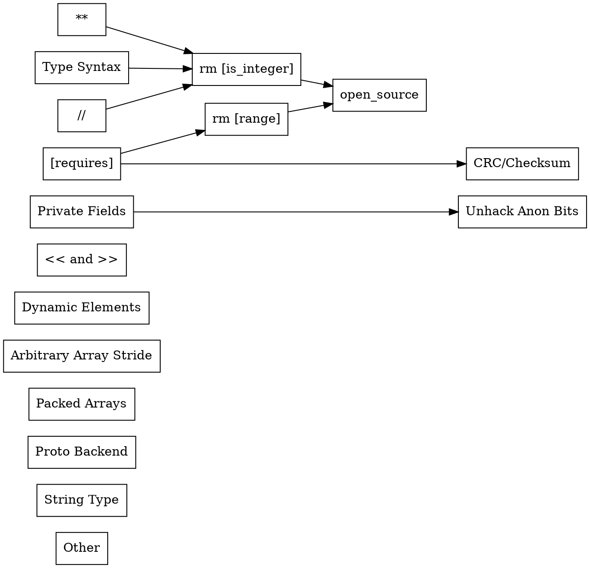

# Emboss Roadmap

Arrows indicate implementation order; that is, "A -> B -> C" means "C depends on
B which depends on A."



[TOC]


## Type Syntax {#type_syn}

A syntax for expressing Emboss expression types.  Likely some variation of set
builder notation:

```
  { x in $integer | 0 <= x <= 510 && x % 2 == 0 }
```

This is needed to replace the `[is_integer]` attribute


## Remove `[is_integer]` {#del_is_integer}

Replace the `[is_integer]` attribute on `external`s with a `[type]` attribute.
This also lets us remove the hack in `expression_bounds.py`.  In passing, it
should also allow `Flag` fields to be used as booleans in expressions.


## Private Fields {#private}

Provide some annotation -- likely an attribute -- that indicates that a field is
"private:" that it should not appear in text format, and that it cannot be
referenced from outside the structure.  From an end user perspective, this is
primarily useful for virtual fields; internally, the automatic structure that
wraps anonymous bits can also be marked private so that the backend can stop
caring about `is_anonymous`.


## Finishing Refactoring Hacky Anonymous Bits Code {#del_anon_hack}

Replace the final uses of <code>*name*.is_anonymous</code> with something that
marks "anonymous" fields as "private."


## `[requires]` on Fields {#requires}

Allow the `[requires]` attribute on fields, which can provide an arbitrary
expression whose value must be `true` for the field to be `Ok()`.


## Remove `[range]` {#del_range}

Replace all extant uses of `[range: low..high]` with `[requires: low <= field <
high]`, and remove support for `[range]`.


## Native Checksum/CRC Support {#checksums}

Add support for checking standard checksums/CRCs, and for automatically
computing them.


## Shift Operators (`<<` and `>>`) {#shift_ops}

Left and right shift operators for use in expressions.


## Flooring Integer Division (`//`) and Modulus (`%`) {#division}

Flooring (not truncating) integer division for use in expressions, and the
corresponding modulus operator.


## Exponentiation (`**`)  {#exponent}

Exponentiation operator.  Mostly needed for `[type]` on `UInt`, `Int`, and
`Bcd`.


## Arrays with Runtime-Sized Elements {#dyn_array_elem_size}

Support for arrays where the element size is not known until runtime; e.g.,
arrays of arrays, where the inner array's size is determined by some variable.


## Arbitrary Array Stride {#array_stride}

Support for arrays where the stride (distance between the starts of successive
elements) is different from the element size.  Needed to support padding between
elements and interlaced elements.


## Large Arrays of `bits` {#arr_of_bits}

Support for large, packed arrays of, e.g., 12-bit integers.  Requires such
arrays to be byte-order-aware, and there are potential readability concerns.


## Proto Backend {#proto_back}

A backend which generates:

1.   A `.proto` file with an "equivalent" set of types.
2.   C++ code that can populate the protos from Emboss views and vice versa.

Essentially, you would be able to serialize to and deserialize from the "proto
form" the same way that you can currently serialize to and deserialize from
text.


## String Type {#strings}

A physical type for strings.  This is complex, because strings can be stored in
many formats.  It is likely that Emboss will only support byte strings, and will
not directly handle character encodings, but that still leaves a number of
common formats:

1.   Length-specified: length is determined by another field.
2.   Delimited: string runs until some delimiter byte; usually zero, but
     sometimes ASCII space or '$'.
3.   Optionally-delimited: string runs until either a delimiter byte *or* some
     maximum size.
4.   Right-padded: string bytes run to some maximum size, but padding bytes
     (usually ASCII space) should be chopped off the end.  Bytes with the
     padding value can appear in the middle.


## Miscellaneous/Potential Features {#misc}

These features could happen if there is interest, but there is no current plan
to implement them.


### Fixed Point

Support for fixed-point arithmetic, both in expressions and physical formats.


### Documentation Backend

Support for an HTML/PDF/???-format documentation generator.


### Python Backend

A code generator for Python.
